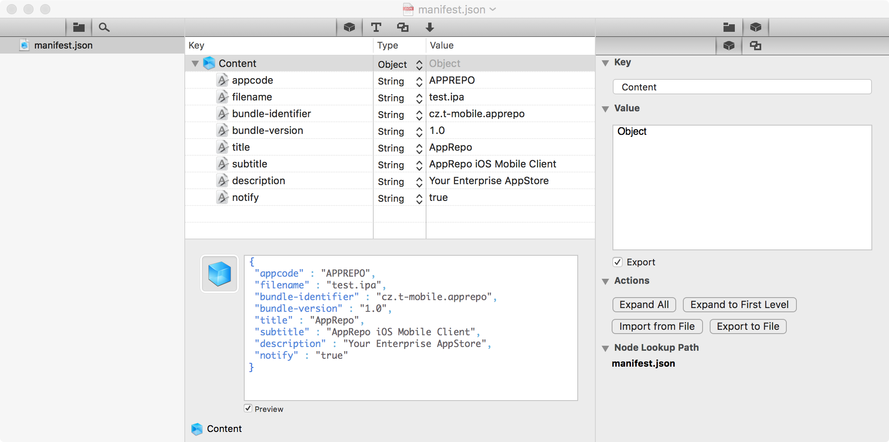

## Available options

All the options below can easily be added to your `Repofile`. The great thing: if you use `fastlane` you can use all these options from your `Fastfile` too, for example:

```ruby
apprepo(
  repo_url: "repo.teacloud.net",
  repo_user: "circle",
  repo_key: "circle.key",
  notify: true
)
```

### Authentication

You can use your `~/.ssh/config` file to setup RSA keys to AppRepo, or use following options:

##### repo_url
An URL of your AppRepo instance.

```ruby
repo_url "apprepo.example.com"
```

##### repo_user
Your SFTP user name.

```ruby
repo_user "apprepo"
```

##### repo_key
Path to your RSA key. Username/password login is not supported for security reasons, but feel free to do it your way.

```ruby
repo_key "/Users/igraczech/.ssh/REPOKey.pem"
```

### Upload Descriptor

##### app_identifier
The application bundle-identifier as we know it.

```ruby
app_identifier "cz.t-mobile.apprepo"
```

##### ipa
A path to a signed ipa file, which will be uploaded. (TODO: If you don't provide this value, only app metadata will be uploaded.)

```ruby
ipa "App.ipa"
```

if you use [fastlane](https://fastlane.tools) the ipa file will automatically be detected.

##### app_version
Optional, as it is usually automatically detected. Specify the version that will appear on AppRepo:

```ruby
app_version "2.0"
```

##### app_build
Optional, as it is usually automatically detected. Specify the build number that will appear on AppRepo:

```ruby
app_build "21"
```

##### notify
Add this to your `Repofile` to automatically notify the AppRepo users after uploading metadata/binary. 

```ruby
notify true
```

##### manifest_path
Path to the manifest.json you want to use. The file has to be structured like this



If you run `apprepo init` this will automatically be created for you.


##### meta_title
Application name on the AppRepo.

```ruby
meta_title AppRepo
```

##### meta_subtitle
Application description (short, one-line, appears in app list)

```ruby
meta_subtitle AppRepo
```

##### meta_description
Application description (detailed)

```ruby
meta_description AppRepo
```


## Metadata

All options below are useful if you want to specify certain app metadata in your `Repofile` or `Fastfile`

### Localised

AppRepo does not support localised values at this time.

### Non-Localised

##### app_icon
A path to a new app icon, which must be exactly 1024x1024px
```ruby
app_icon './AppIcon.png'
```
